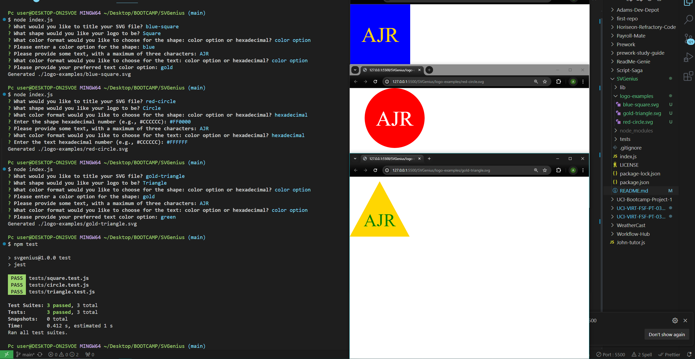

# SVGenius

SVGenius is a command-line application tool enabling users to craft personalized SVG logos by inputting details like file name, text, text color, shape, and shape color. It then creates an SVG file with the given name, incorporating the user's specifications. The application further showcases the generated logo in a web browser.

- The application prompts users to input values for various parameters including file name, text content, text color, shape type, and shape color.

- The application supports both color keywords and hexadecimal numbers for specifying colors.

- The application offers a selection of shapes to choose from, including circle, triangle, and square.

- The application generates an SVG file with the provided name.

- Outputs the message "`Generated ${fileName}`" upon successful file creation.

## Installation

To install SVGenius:

- Clone the repository: https://github.com/AcoderRose/SVGenius

- Go to the project directory

- Launch the terminal and execute the following command: "`npm install`".

## Usage

Run the following command in your terminal to use SVGenius: "`node index.js`".

- The user will be prompted to enter the desired name for the SVG file they want to create. The file will be saved with the specified name and a .svg extension.

- The user will be asked to input text for the logo, allowing for a maximum of three characters.

- The user will be asked to specify the color for the text, where they can input either a color keyword or a hexadecimal number.

- The user will need to choose a shape for the logo from the available options: Circle, Triangle, or Square.

- The user will then need to specify the color for the shape. They can either enter a color keyword or a hexadecimal number.

Once the user has provided all the required information, an SVG file with the User specified name will be generated, and they will see a message in the command line confirming the successful creation, shown as "`Generated ${fileName}`". The logo will be generated into a 300x200 pixel image.

[Link to Walk Through Video](https://drive.google.com/file/d/1vhbr93YDmaBLNjKKtOXXn-KKBVg-gLgN/view?usp=sharing)

## Credits

[Kaila Ronquillo](https://github.com/girlnotfound)

[Ryan Petersen](https://github.com/RyanPetersen-89)

[Jordan Gonzales](https://github.com/JordanGWiz)

## Tests

In order to run the tests for SVGenius execute the following command in the command line: "`npm test`"
